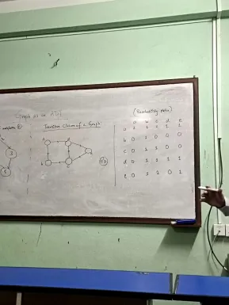

# Graph as ADT
G(V,E) is a collection of vertices and edges connecting vertices and edges connecting those vertices
- Directed Edge
- undirected Edge
- Directed Graph
- undirected Graph

## Indegree & Outdegree
- indegree: incoming edges
- outdegree: outgoing edges

## Transitive closure of a graph

## all path shortest path (Floyd Warshal Algorithm)

## graph travelsal
the process of visiting and exploring a graph for processing is called graph travelsal
- breadth first search (BFS)
- depth firsy search (DFS)

## Spanning Tree
A connected subgraph 's' of graph G(V,E) is said to be spanning iff (if and only if)
- 's' should contain all vaetices of G
- 's' should contain 'lvl 1' edges
